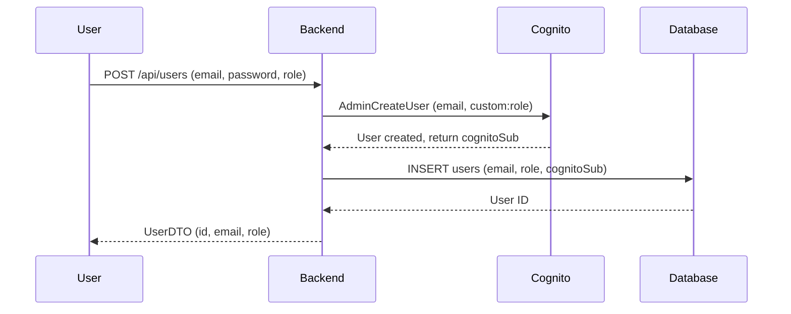
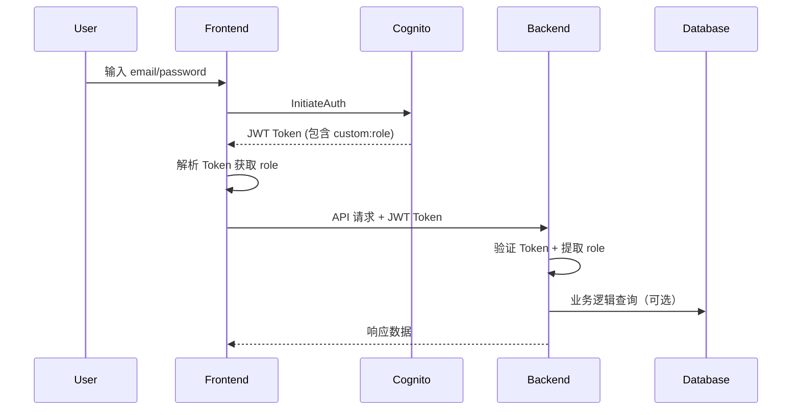

# AWS Cognito 自定义 Role 属性配置指南

## 📋 为什么需要在 Cognito 中存储 Role？

### 🎯 业务需求
在 DoorDash 系统中，我们有三种用户角色：
- 👤 **CUSTOMER** - 普通客户（下单、评价）
- 🏪 **RESTAURANT_OWNER** - 餐厅老板（管理餐厅和菜单）
- 🚗 **DRIVER** - 配送司机（接单配送）

**必须能够快速准确地识别用户角色，以实现权限控制和业务逻辑。**

### 🔄 双重存储策略

| 存储位置 | 作用 | 优点 |
|---------|------|------|
| **本地数据库** | 主数据存储 | 完整的用户信息，支持复杂查询 |
| **AWS Cognito** | 认证 + JWT Token | Token 中包含 role，无需额外 API 调用 |

### ✅ 实际应用场景

#### 场景 1: 前端路由保护
```javascript
// 前端从 JWT Token 直接读取 role，无需调用后端 API
const token = parseJWT(idToken);
const userRole = token['custom:role']; // 'CUSTOMER' | 'RESTAURANT_OWNER' | 'DRIVER'

if (userRole === 'RESTAURANT_OWNER') {
  // 显示餐厅管理菜单
  showRestaurantDashboard();
} else if (userRole === 'DRIVER') {
  // 显示配送员界面
  showDriverDashboard();
}
```

#### 场景 2: Spring Security 权限验证
```java
// Spring Security 从 JWT Token 直接验证角色，无需查询数据库
@PreAuthorize("hasAuthority('RESTAURANT_OWNER')")
@GetMapping("/api/restaurants/manage")
public ResponseEntity<List<Restaurant>> getMyRestaurants() {
    // 只有餐厅老板可以访问
}
```

#### 场景 3: 减少数据库查询
```
传统方式（仅本地存储）:
1. 用户请求 → 验证 Token
2. 从 Token 获取 userId
3. 查询数据库获取 role ❌ 额外的数据库查询
4. 执行业务逻辑

优化方式（Cognito + 本地）:
1. 用户请求 → 验证 Token
2. 从 Token 直接读取 role ✅ 无需数据库查询
3. 执行业务逻辑
```

---

## 🛠️ AWS Cognito 配置步骤

### 步骤 1: 登录 AWS Console
1. 打开 https://console.aws.amazon.com/cognito/
2. 选择区域: **us-east-1 (North Virginia)**
3. 点击你的 User Pool: **us-east-1_a6gt5CsAi**

### 步骤 2: 添加自定义属性
1. 在左侧菜单点击 **Sign-up experience**
2. 点击 **Attributes** 标签页
3. 滚动到 **Custom attributes** 部分
4. 点击 **Add custom attribute** 按钮

### 步骤 3: 配置 Role 属性
填写以下信息：

| 字段 | 值 | 说明 |
|------|-----|------|
| **Attribute name** | `role` | 属性名称（会自动添加 `custom:` 前缀） |
| **Data type** | `String` | 字符串类型 |
| **Min length** | `6` | 最小长度（DRIVER = 6 个字符） |
| **Max length** | `20` | 最大长度（RESTAURANT_OWNER = 16 个字符） |
| **Mutable** | ✅ `Yes` | 允许修改（用户角色可能会变更） |

### 步骤 4: 保存配置
1. 点击 **Add custom attribute** 按钮确认
2. 等待配置生效（通常立即生效）

### 步骤 5: 验证配置
1. 在 **Attributes** 页面的 **Custom attributes** 部分
2. 应该能看到：
   ```
   custom:role (String, Mutable)
   ```

---

## 🔧 代码已经准备就绪

代码已更新完毕，包含 `custom:role` 的存储逻辑：

### CognitoService.java
```java
// 创建用户时会自动将 role 存储到 Cognito
attributes.put("custom:role", request.getRole().toString());

AdminCreateUserRequest cognitoRequest = AdminCreateUserRequest.builder()
    .userPoolId(userPoolId)
    .username(username)
    .userAttributes(
        // ... 其他属性
        AttributeType.builder()
            .name("custom:role")
            .value(request.getRole().toString())
            .build()
    )
    .build();
```

---

## 🧪 测试步骤

### 测试 1: 创建新用户
完成 AWS 配置后，重新构建应用并测试：

```bash
# 1. 重新构建应用
docker-compose down && docker-compose up -d --build

# 2. 等待应用启动
sleep 15

# 3. 创建 CUSTOMER 用户
curl -X POST http://localhost:8080/api/users \
  -H "Content-Type: application/json" \
  -d '{
    "email": "customer@example.com",
    "password": "Test@123",
    "firstName": "John",
    "lastName": "Doe",
    "phoneNumber": "+16263805884",
    "role": "CUSTOMER"
  }'

# 4. 创建 RESTAURANT_OWNER 用户
curl -X POST http://localhost:8080/api/users \
  -H "Content-Type: application/json" \
  -d '{
    "email": "owner@restaurant.com",
    "password": "Test@123",
    "firstName": "Jane",
    "lastName": "Smith",
    "phoneNumber": "+16263805885",
    "role": "RESTAURANT_OWNER"
  }'

# 5. 创建 DRIVER 用户
curl -X POST http://localhost:8080/api/users \
  -H "Content-Type: application/json" \
  -d '{
    "email": "driver@delivery.com",
    "password": "Test@123",
    "firstName": "Mike",
    "lastName": "Johnson",
    "phoneNumber": "+16263805886",
    "role": "DRIVER"
  }'
```

### 测试 2: 验证 Cognito 中的数据
1. 打开 AWS Cognito Console
2. 进入 User Pool: us-east-1_a6gt5CsAi
3. 点击 **Users** 标签
4. 点击任意用户查看详情
5. 在 **Attributes** 部分应该能看到：
   ```
   custom:role: CUSTOMER (或 RESTAURANT_OWNER、DRIVER)
   ```

### 测试 3: 验证本地数据库
```bash
# 连接到数据库查看 role
docker exec -it doordash-postgres psql -U doordash_user -d doordash_db -c "SELECT id, email, role, cognito_sub FROM users;"
```

预期输出：
```
 id |        email         |       role        |          cognito_sub           
----+----------------------+-------------------+-------------------------------
  1 | customer@example.com | CUSTOMER          | xxxxxxxx-xxxx-xxxx-xxxx-xxxxxx
  2 | owner@restaurant.com | RESTAURANT_OWNER  | yyyyyyyy-yyyy-yyyy-yyyy-yyyyyy
  3 | driver@delivery.com  | DRIVER            | zzzzzzzz-zzzz-zzzz-zzzz-zzzzzz
```

---

## 📊 完整的数据流程

### 用户注册流程


### 用户登录 + 权限验证流程


---

## 🔒 安全性说明

### 为什么需要双重存储？

1. **JWT Token 可以被篡改吗？**
   - ❌ 不能！JWT 有签名验证，Cognito 的私钥只有 AWS 拥有
   - ✅ 后端会验证 Token 签名，确保 role 未被修改

2. **Token 中的 role 和数据库不一致怎么办？**
   - 使用 **updateUserAttributes** 同步更新
   - 关键操作仍然验证数据库中的 role

3. **最佳实践**
   ```java
   // 读取操作：优先使用 Token 中的 role（性能优化）
   String roleFromToken = jwtToken.getClaim("custom:role");
   
   // 写入/敏感操作：验证数据库中的 role（安全保障）
   User user = userRepository.findById(userId);
   if (user.getRole() == UserRole.RESTAURANT_OWNER) {
       // 执行敏感操作
   }
   ```

---

## ❓ 常见问题 FAQ

### Q1: 如果不在 Cognito 存储 role 会怎样？
**A:** 可以正常运行，但每次 API 请求都需要查询数据库获取 role，增加数据库负载。

### Q2: Cognito 中的 role 可以修改吗？
**A:** 可以！通过 `AdminUpdateUserAttributes` 更新，`UserService` 已经实现了同步逻辑。

### Q3: 用户注册后可以更改角色吗？
**A:** 可以，但需要管理员权限。使用 `PATCH /api/users/{id}` 更新角色。

### Q4: 为什么不用 Cognito Groups？
**A:** Cognito Groups 适合复杂的权限系统，但我们只有 3 个固定角色，使用 custom:role 更简单高效。

---

## 📝 总结

| 配置项 | 状态 |
|--------|------|
| ✅ 本地数据库存储 role | 已完成 |
| ✅ CognitoService 代码更新 | 已完成 |
| ⏳ AWS Cognito 自定义属性配置 | **待完成（需要你手动配置）** |
| ⏳ 测试验证 | 配置完成后测试 |

**下一步操作**：
1. 按照上述步骤在 AWS Console 添加 `custom:role` 属性
2. 重新构建应用: `docker-compose down && docker-compose up -d --build`
3. 运行测试命令验证功能
4. 检查 Cognito Console 和数据库确认数据同步

配置完成后，系统将实现：
- 🚀 **性能优化** - 减少数据库查询
- 🔒 **安全保障** - JWT 签名验证
- 📱 **前端友好** - 无需额外 API 获取角色
- 🎯 **权限控制** - Spring Security 无缝集成
