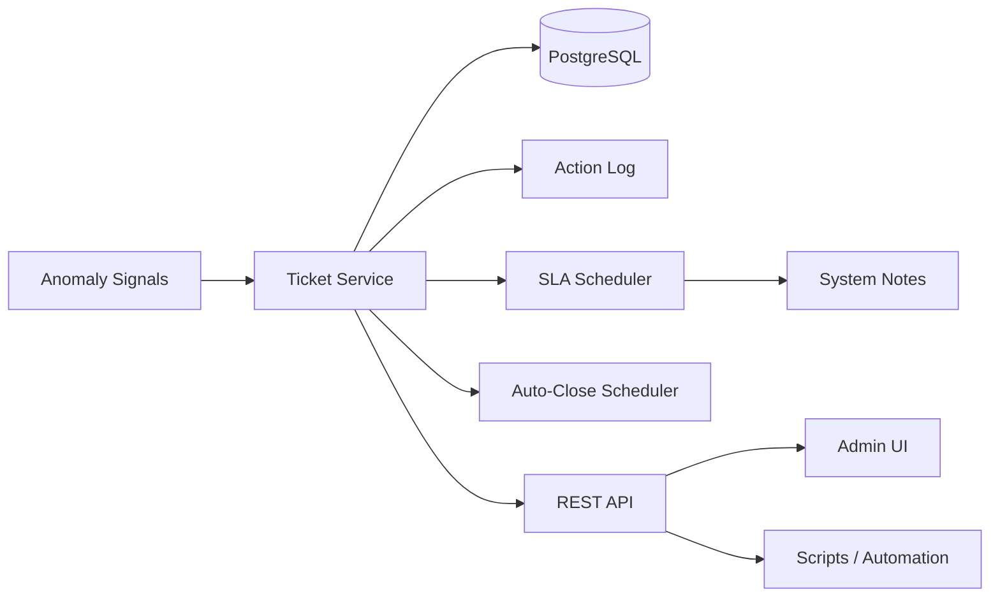

# Order AI Agent – Implementation Summary

## Overview
This document explains what was built for the Order AI Agent, how it is architected in this codebase, and the results delivered. The agent is designed to detect operational anomalies, open actionable tickets, guide human agents, and close the loop with auditability and SLA enforcement.

## What was built
- **Anomaly → Ticket → Agent workflow** with enriched evidence payloads.
- **Action execution + writeback** so agents can trigger actions and record outcomes.
- **SLA visibility and enforcement** (deadlines, overdue flags, alerts, auto-close).
- **Audit trail and admin observability** (audit logs, runtime status card, exports).
- **Automation scripts** to seed tickets and run regression checks.

## Architecture (high level)
The Order AI Agent spans backend services, database tables, scheduled jobs, and the admin UI.

## Key backend components
- **Ticket lifecycle & evidence mapping**
  - `src/main/java/.../TicketService.java`
  - `src/main/java/.../TicketDTO.java`
- **SLA automation**
  - `src/main/java/.../TicketSlaScheduler.java` (SLA reminders)
  - `src/main/java/.../TicketAutoCloseScheduler.java` (auto-close resolved tickets)
- **Action execution & writeback**
  - `src/main/java/.../TicketActionLog.java`
  - `src/main/java/.../TicketActionLogRepository.java`
- **Audit & stability fixes**
  - `src/main/java/.../DatabaseSchemaUpdater.java` (schema updates)
  - `src/main/java/.../JwtAuthenticationFilter.java` (auth flow refinements)

## Key frontend components
- **Admin ticket board + SLA visualization**
  - `frontend/src/pages/AdminTickets.jsx`
- **Ticket detail timeline with SLA alerts & actions**
  - `frontend/src/pages/AdminTicketDetail.jsx`
- **Audit log viewer with pagination and export**
  - `frontend/src/pages/AdminAuditLogs.jsx`

## Data model highlights
- **`tickets`**: status, priority, SLA timestamps
- **`ticket_comments`**: system notes (SLA alerts, auto-close)
- **`ticket_action_logs`**: action history + results

## Automation and validation scripts
- **Seed data with full agent chain**
  - `scripts/seed-agent-tickets.sh`
  - Supports fixed category/restaurant, evidence JSON, overdue simulation, SLA alerts, action writeback, auto-close checks.
- **Regression smoke checks**
  - `scripts/regression-smoke.sh`

## Results delivered
- End-to-end agent workflow from anomaly signals to ticket closure.
- SLA metrics visible in admin UI and enforced through reminders and auto-close.
- Action execution results persist and automatically resolve tickets when successful.
- Auditability with paginated logs, filters, and CSV exports.
- Repeatable seeding and regression scripts for fast validation.

## Notes
This README focuses on the Order AI Agent layer. For system-level setup, see `README.md` / `README_EN.md` and the docs under `docs/`.
